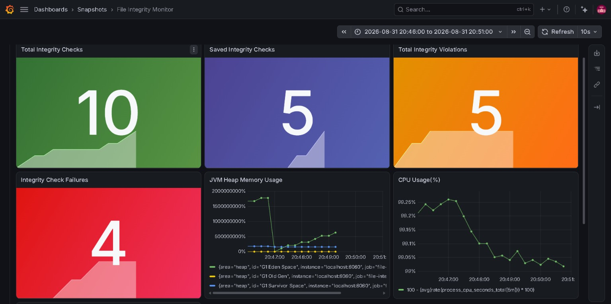
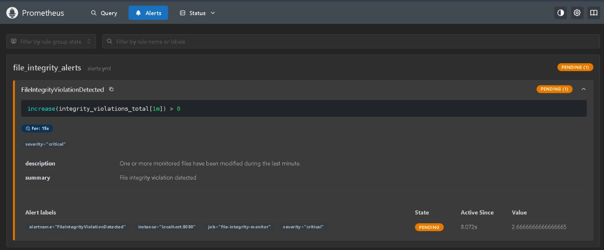
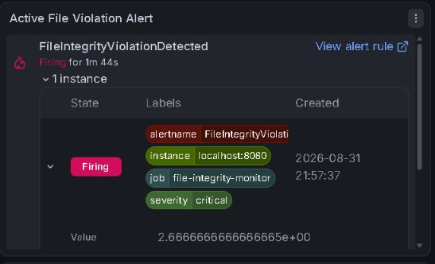
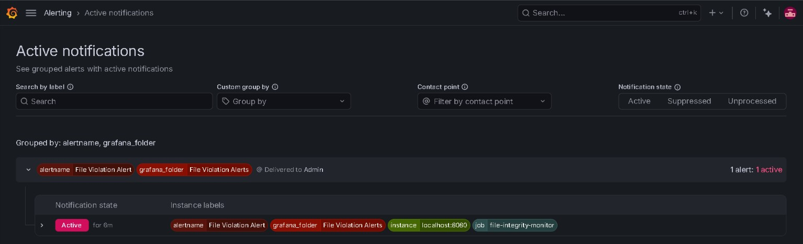

# File Integrity Monitoring & Alerting System

A Spring Boot application that monitors files for changes using SHA-256
hashing. The application stores baseline hashes, compares them with the
current file state, runs scheduled checks, and exposes metrics that can
be monitored with Prometheus and Grafana.

## Features

-   SHA-256 hashing for file integrity checks
-   Baseline hash storage and comparison
-   Detection of file modifications
-   Scheduled integrity checks
-   REST-based application access
-   Custom integrity metrics
-   Spring Boot Actuator and Prometheus metrics
-   Prometheus alert rules for integrity violations
-   Grafana dashboards for integrity and application metrics

## How It Works

``` text
Monitored File
      ↓
SHA-256 Hash
      ↓
Compare with Baseline
      ↓
Change Detected / No Change
      ↓
Scheduled Metrics Collection
      ↓
Prometheus
      ↓
Grafana Dashboard and Alerts
```

## Tech Stack

-   Java 17
-   Spring Boot
-   Maven
-   Spring Boot Actuator
-   Micrometer
-   Prometheus
-   Grafana

## Prerequisites

Install the following before running the complete project locally:

-   Java 17
-   Maven
-   Git
-   Prometheus (optional for metrics and alerting)
-   Grafana (optional for dashboards and notifications)

Verify Java and Maven:

``` bash
java -version
mvn -version
```

## Getting Started

### 1. Clone the repository

``` bash
git clone https://github.com/SuryaBramananthan24/file-integrity-monitor.git
cd file-integrity-monitor
```

### 2. Run the application

``` bash
mvn spring-boot:run
```

The Spring Boot application starts on:

``` text
http://localhost:8080
```

### 3. Verify application metrics

Open:

``` text
http://localhost:8080/actuator/prometheus
```

You should see Prometheus-compatible application and integrity metrics.

## Prometheus Setup

The repository contains Prometheus configuration files in:

``` text
monitoring/
└── prometheus/
    ├── prometheus.yml
    └── alerts.yml
```

Start Prometheus using the configuration from this project:

``` bash
prometheus --config.file=monitoring/prometheus/prometheus.yml
```

On Windows, depending on your installation:

``` powershell
.\prometheus.exe --config.file=monitoring\prometheus\prometheus.yml
```

Open Prometheus:

``` text
http://localhost:9090
```

The configured application target should expose metrics from:

``` text
http://localhost:8080/actuator/prometheus
```

## Alerting

The project includes a Prometheus alert for newly detected integrity
violations.

Alert expression:

``` promql
increase(integrity_violations_total[1m]) > 0
```

The alert rule is configured in:

``` text
monitoring/prometheus/alerts.yml
```

After a new violation is detected, Prometheus evaluates the rule and the
alert moves through:

``` text
INACTIVE → PENDING → FIRING
```

## Grafana Setup

1.  Start Grafana locally.
2.  Open:

``` text
http://localhost:3000
```

3.  Add Prometheus as a data source.
4.  Use the Prometheus server URL:

``` text
http://localhost:9090
```

5.  View the configured integrity and application monitoring dashboards.

The dashboards include metrics such as:

-   Total integrity checks
-   Successful integrity checks
-   Total integrity violations
-   Integrity check failures
-   JVM memory usage
-   CPU usage
-   Application uptime
-   HTTP request metrics

## Project Structure

``` text
file-integrity-monitor/
│
├── src/
│   ├── main/
│   └── test/
│
├── monitoring/
│   └── prometheus/
│       ├── prometheus.yml
│       └── alerts.yml
│
├── screenshots/
│
├── pom.xml
├── .gitignore
└── README.md
```

## Screenshots

### File Integrity Dashboard




### Prometheus Alert



### Grafana Alert




## Current Status

Completed:

-   [x] SHA-256 hashing
-   [x] Baseline storage
-   [x] Integrity comparison
-   [x] Scheduled monitoring
-   [x] REST integration
-   [x] Spring Boot Actuator and Micrometer metrics
-   [x] Prometheus integration
-   [x] Prometheus alert rules
-   [x] Grafana dashboards
-   [x] Alert notifications

Planned:

-   [ ] Docker containerization
-   [ ] Docker Compose setup
-   [ ] Jenkins pipeline
-   [ ] Additional automated tests

